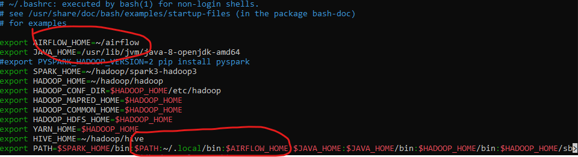
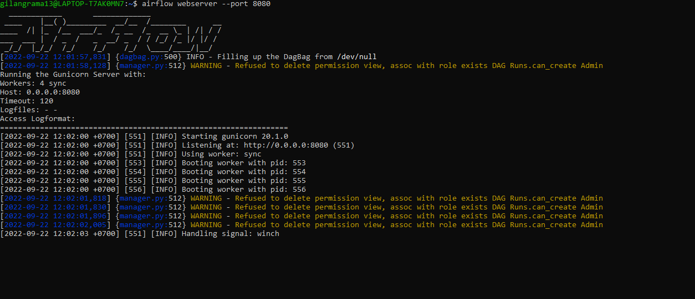
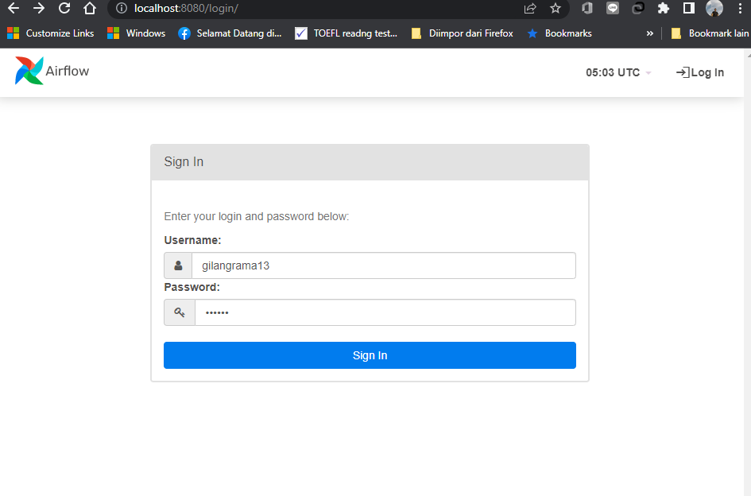

# How To Install Airflow on WSL
Airflow is a Python based workflow tool published by Apache to allow you to create, schedule and monitor workflows programmatically. It's a common tool used in modern data engineering practice

## Prerequisite
- __WSL 2__
- __Python >= 3.6__
- __pip 3__

## Installation
1. Create __Airflow__ folder and add the __AIRFLOW_HOME__ environment variables to __~/.bashrc__ using the created folder as destination.
    ```
    # create airflow folder
    mkdir ~/airflow
    # add line below to ~/.bashrc
    export AIRFLOW_HOME=~/airflow
    export PATH=$PATH:~/.local/bin:$AIRFLOW_HOME
    # apply the modified ~/.bashrc 
    source ~/.bashrc
    ```
    
2. Install the Airflow by specified the airflow version, python version, and constraint url. This exploration using __Airflow 2.2.3__.
    ```
    AIRFLOW_VERSION=2.2.3
    PYTHON_VERSION="$(python --version | cut -d " " -f 2 | cut -d "." -f 1-2)"
    CONSTRAINT_URL="https://raw.githubusercontent.com/apache/airflow/constraints-${AIRFLOW_VERSION}/constraints-${PYTHON_VERSION}.txt"
    pip3 install "apache-airflow==${AIRFLOW_VERSION}" --constraint "${CONSTRAINT_URL}"
    ```
3. Initialize database using command below
    ```
    airflow db init
    ```
    the above command will automatically create __AIRFLOW_HOME__ folder if the folder not exist before and all the airflow configuration will be stored inside __AIRFLOW_HOME__ environment variables.
4. Create admin user using command below
    ```
    airflow users create \
    --username yourUsername \
    --firstname YourName \
    --lastname LastName \
    --role Admin \
    --email ***@mail.id
    ```
    you need to insert password while creating the username.
5. Your installation done, you can start webserver service using command below
    ```
    airflow webserver --port 8080
    ```
    </br>
    Remember to change the port number to a different one if it is already used by other services in your system. Open the website in browser: http://localhost:8080/.</br>
    </br>

## References
- https://kontext.tech/article/929/install-airflow-on-windows-via-windows-subsystem-for-linux
- https://towardsdatascience.com/run-apache-airflow-on-windows-10-without-docker-3c5754bb98b4
- https://www.astronomer.io/guides/airflow-wsl/
