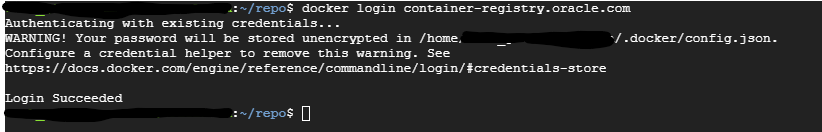
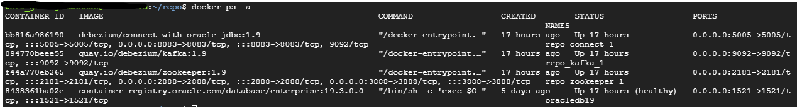

# How to install Debezium with Oracle using Docker
Based on the [official website](https://debezium.io/documentation/reference/2.0/connectors/oracle.html), Debezium ingests change events from Oracle by using the native LogMiner database package or the XStream API. While the connector might work with a variety of Oracle versions and editions, only Oracle EE 12 and 19 have been tested. This exploration will use LogMiner to connect oracle and debezium. Some of file in this exploration are copied from [debezium-tutorial](https://github.com/debezium/debezium-examples/tree/main/tutorial) and [oracle-vagrant](https://github.com/debezium/oracle-vagrant-box).

## Prerequisite
- `docker`
- `docker-compose`
- Oracle container registry account

## Installation
1. Login to your Oracle container registry account
    ```
    docker login container-registry.oracle.com
    ```
    You need to login using your username and password. The image below the user already login before and don't need to fill the username and password.
    
2. Create multiple container that we need using `docker-compose`. You can modify [docker-compose file](./docker-compose.yaml) before creating the container. Refer to [this document](https://github.com/oracle/docker-images/tree/main/OracleDatabase/SingleInstance#running-oracle-database-in-a-container) if you need to modify the Oracle environment.
    ```
    # Start the topology as defined in https://debezium.io/documentation/reference/stable/tutorial.html
    export DEBEZIUM_VERSION=1.9
    docker-compose -f docker-compose-oracle.yaml up --build
    ```
    Open new terminal and check if all container already activated using `docker ps -a`.
    
3. Create directory to define the location of Fast Recovery Area (FRA)
    > The db_recovery_file_dest parameter defines the location of the Flash Recovery Area (FRA) and the db_recovery_file_dest parameter specifies the default location for the recovery area. The recovery area contains multiplexed copies of the following files: Control files, Online redo logs, Archived redo logs, Flashback logs, RMAN backups. When you use the db_recovery_file_dest parameter to specify the destination of your flash recovery area, you can use a directory, file system, or ASM disk group as your destination
    ```
    docker exec -it <oracle container name> bash
    mkdir /opt/oracle/oradata/recovery_area
    ```
4. Set up LogMiner in oracle using command below
    ```
    cat setup-logminer.sh | docker exec -i <your_oracle_container_name> bash
    ```
5. Create table and ingest data using [inventory file](debezium-with-oracle-jdbc/init/inventory.sql) using command below
    ```
    cat debezium-with-oracle-jdbc/init/inventory.sql | docker exec -i <your_oracle_container_name> sqlplus <username>/<password>@//localhost:<port>/<oracle database PDB name>
    ```
6. Check Kafka Connect status.
    ```
    curl -H "Accept:application/json" localhost:8083/
    ```
    Check the list of connectors registered with Kafka Connect:
    ```
    curl -H "Accept:application/json" localhost:8083/connectors/
    ```
    If there are no connectors, the terminal will return empty list `[]`.
7. Deploy the connector using file [register-logminer-oracle.json](./register-logminer-oracle.json). Adjust the file first before deploying using command below
    ```
    # Start Oracle connector
    curl -i -X POST -H "Accept:application/json" -H  "Content-Type:application/json" http://localhost:8083/connectors/ -d @register-oracle-logminer.json
    ```
8. Test ingest data to oracle. This case will use `customers` table.
    ```
    # Create a test change record
    echo "INSERT INTO customers VALUES (NULL, 'John', 'Doe', 'john.doe@example.com');" | docker exec -i <your_oracle_container_name> sqlplus <username>/<password>@//localhost:<port>/<oracle database PDB name>
    ```
9. Consume messages from debezium topic using command below
    ```
    docker-compose -f docker-compose-oracle.yaml exec kafka /kafka/bin/kafka-console-consumer.sh \
    --bootstrap-server kafka:9092 \
    --from-beginning \
    --property print.key=true \
    --topic server1.DEBEZIUM.CUSTOMERS
    ```