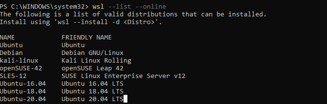

# How To Enable WSL in Windows

WSL (Winndows Subsystem for Linux) is a feature of Windows that enables us to run Linux file system.

## Prerequisite
- Windows 10 version 2004 and higher (Build 19041 and higher) or Windows 11.
    
    > Check windows version using __Windows logo key__ + __R__, type __winver__, select __OK__

## Installation
1. Run __Windows PowerShell__ as __Administrator__.

2. install wsl using this command
    ```
    wsl --install
    ```
3. Select the available Linux distributions using this command
    ```
    wsl --list --online
    ```
    The available distributions that can be installed so far are listed on the below image.
    
4. Install the available distributions using this command
    ```
    wsl --install -d <Distro>
    ```
5. __Restart__ computer
6. Go to __Microsoft Store__ and download the distro you have installed on your computer.
    
7. Access wsl by open your __powershell__ then execute below command
    ```
    wsl
    ```
    
    Or open the downloaded distributions.
    
8. Create your username and password
9. Done 


