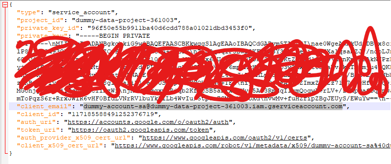
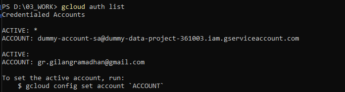

# GCP Exploration

## Connect to GCP using credentials
### Prerequisite
- Python >= 3.6
### Install gcloud CLI
The Google Cloud CLI includes the `gcloud`, `gsutil` and `bq` command-line tools.
- Windows
    ```
    (New-Object Net.WebClient).DownloadFile("https://dl.google.com/dl/cloudsdk/channels/rapid/GoogleCloudSDKInstaller.exe", "$env:Temp\GoogleCloudSDKInstaller.exe")
    & $env:Temp\GoogleCloudSDKInstaller.exe

    ```
- Ubuntu
    1. install `apt-transport-https`
        ```
        sudo apt-get install apt-transport-https ca-certificates gnupg
        ```
    2. Add the gcloud CLI distribution URI as a package source. If your distribution supports the signed-by option, run the following command:
        ```
        echo "deb [signed-by=/usr/share/keyrings/cloud.google.gpg] https://packages.cloud.google.com/apt cloud-sdk main" | sudo tee -a /etc/apt/sources.list.d/google-cloud-sdk.list
        ```
    3. Import the Google Cloud public key. If your distribution's apt-key command supports the --keyring argument, run the following command:
        ```
        curl https://packages.cloud.google.com/apt/doc/apt-key.gpg | sudo apt-key --keyring /usr/share/keyrings/cloud.google.gpg add -
        ```
        If your distribution's apt-key command doesn't support the --keyring argument, run the following command:
        ```
        curl https://packages.cloud.google.com/apt/doc/apt-key.gpg | sudo apt-key add -
        ```
    4. Update and install the gcloud CLI:
        ```
        sudo apt-get update && sudo apt-get install google-cloud-cli
        ```
### Initialize using your account
1. Run `gcloud init`
    ```
    gcloud init --no-launch-browser
    ```
2. Login to your google account and follow the instruction
3. If you need to add another account, run `gcloud auth login`
4. Authorize with `service-account`
    - run `gcloud auth activate-service-account ACCOUNT --key-file=KEY_FILE`
    - fill `ACCOUNT` with your service-account email, and `KEY_FILE` with credential path.
    - Example, I have dummy-account-sa@dummy-data-project-361003.iam.gserviceaccount.com service account email, this email can found in your json credential. Then, I save my json credentials in /home/user/gcp_creds</br>
    </br>
    So I have to run command below to add my sa account.
        ```
        gcloud auth activate-service-account dummy-account-sa@dummy-data-project-361003.iam.gserviceaccount.com --key-file=/home/user/gcp_creds/dummy-service-account.json
        ```
5. You need to check which account is active using `gcloud auth list`. There is `*` in your active account.</br>
</br>

### Authenticating using python
1. Install `google-cloud-bigquery` library
2. Save your json credentials
3. Refer to this [notebook](bigquery-connect.ipynb) to connect and query example
