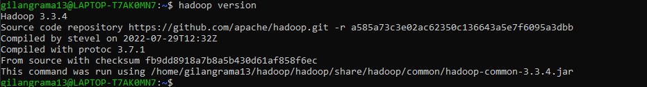

# How To Install Hadoop on WSL
The Apache Hadoop software library is a framework that allows for the distributed processing of large data sets across clusters of computers using simple programming models. It is designed to scale up from single servers to thousands of machines, each offering local computation and storage.

## Prerequisite
- __Java JDK 1.8__. Check the installed java using command below
    ```
    java -version
    ```
    If the __Java__ haven't installed, install the __Java__ using command below
    ```
    sudo apt update
    sudo apt-get install openjdk-8-jdk
    ```
    </br>
- Make sure we can execute __SSH__ to __localhost__ in wsl using command below
    ```
    ssh localhost
    ```
    </br>
    Run the following command to initialize private and public keys, so we can ssh to localhost without a passphrase.
    ```
    ssh-keygen -t rsa -P '' -f ~/.ssh/id_rsa
    cat ~/.ssh/id_rsa.pub >> ~/.ssh/authorized_keys
    chmod 0600 ~/.ssh/authorized_keys
    ```
    If there is `ssh: connect to host localhost port 22: Connection refused` issue, run the command below
    ```
    sudo apt remove openssh-server
    sudo apt install openssh-server
    sudo service ssh start
    ```
    If the above command is not working and the issue stil occur, you can refer to this [article](https://superuser.com/questions/1111591/how-can-i-ssh-into-bash-on-ubuntu-on-windows-10). From the article, we can solve the issue using the step below.

    1. Uninstalled ssh-server, reinstalled it and made sure it's started with `sudo service ssh --full-restart`
    2. `sudo apt-get purge openssh-server`
    3. `sudo apt-get install openssh-server`
    4. Modify the sshd_config `sudo nano /etc/ssh/sshd_config`
    5. Add or modify line below:
        ```
        #disallow root login by setting 
        PermitRootLogin no
        AllowUsers yourusername
        # Make sure PasswordAuthentication is set to yes if you want to login using a password.
        PasswordAuthentication yes
        # Disable privilege separation by modifying 
        UsePrivilegeSeparation no
        ```
    6. `sudo service ssh --full-restart`

## Installation
1. Go to [Hadoop Download Page](https://hadoop.apache.org/releases.html). Choose the Hadoop version then Download the __Binary Download__. In this exploration I use the __hadoop-3.3.4__. Or you can direct download the Apache Hadoop using command below in __WSL__
    ```
    wget https://www.apache.org/dyn/closer.cgi/hadoop/common/hadoop-3.3.4/hadoop-3.3.4.tar.gz
    ```
    </br>
2. Unpack the downloaded binary file to destination path
    ```
    # Example destination path ~/hadoop/hadoop
    mkdir -p ~/hadoop/hadoop
    # Unpack hadoop file
    tar -xvzf hadoop-3.3.4.tar.gz -C ~/hadoop/hadoop --strip 1
    ```
3. Setup __Environment Variables__ by modify the `.bashrc`.
    ```
    nano ~/.bashrc
    ```
    and add the hadoop __environment variables__ as below and save the file.
    ```
    export JAVA_HOME=/usr/lib/jvm/java-8-openjdk-amd64
    export SPARK_HOME=~/hadoop/spark
    export HADOOP_HOME=~/hadoop/hadoop
    export HADOOP_CONF_DIR=$HADOOP_HOME/etc/hadoop
    export HADOOP_MAPRED_HOME=$HADOOP_HOME
    export HADOOP_COMMON_HOME=$HADOOP_HOME
    export HADOOP_HDFS_HOME=$HADOOP_HOME
    export YARN_HOME=$HADOOP_HOME
    export PATH=PATH=$SPARK_HOME/bin:$PATH:~/.local/bin:$AIRFLOW_HOME:$JAVA_HOME:$JAVA_HOME/bin:$HADOOP_HOME/bin:$HADOOP_HOME/sbin
    ```
    Then apply the modified `.bashrc` file using command below
    ```
    source ~/.bashrc
    ```
    If the command already executed, make sure the Hadoop installed properly.</br>
    </br>

## Configure pseudo-distributed mode (Single Node mode)
The official document to configure a single node cluster please refer to this [page](https://hadoop.apache.org/docs/r3.3.0/hadoop-project-dist/hadoop-common/SingleCluster.html#Pseudo-Distributed_OperationPseudo-Distributed_Operation).
All the configuration files should be available under `~/hadoop/hadoop/etc/hadoop`, we need to go to the path to configure the files using command below.
```
cd ~/hadoop/hadoop/etc/hadoop
```
Follow below steps to configure the files:
1. Edit file `hadoop-env.sh`
    ```
    nano hadoop-env.sh
    ```
    Set Java environment variable as command below
    ```
    export JAVA_HOME=/usr/lib/jvm/java-8-openjdk-amd64
    ```
2. Edit file `core-site.xml`
    ```
    nano core-site.xml
    ```
    Add the below configuration
    ```
    <configuration>
        <property>
            <name>fs.defaultFS</name>
            <value>hdfs://localhost:9000</value>
        </property>
    </configuration>
    ```
3. Edit file `hdfs-site.xml`
    ```
    nano hdfs-site.xml
    ```
    Add the below configuration
    ```
    <configuration>
        <property>
            <name>dfs.replication</name>
            <value>1</value>
        </property>
    </configuration>
    ```
4. Edit file `mapred-site.xml`
    ```
    nano mapred-site.xml
    ```
    Add the below configuration
    ```
    <configuration>
        <property>
            <name>mapreduce.framework.name</name>
            <value>yarn</value>
        </property>
        <property>
            <name>mapreduce.application.classpath</name>
            <value>$HADOOP_MAPRED_HOME/share/hadoop/mapreduce/*:$HADOOP_MAPRED_HOME/share/hadoop/mapreduce/lib/*</value>
        </property>
    </configuration>
    ```
5. Edit file `yarn-site.xml`
    ```
    nano yarn-site.xml
    ```
    Add the below configuration
    ```
    <configuration>
        <property>
            <name>yarn.nodemanager.aux-services</name>
            <value>mapreduce_shuffle</value>
        </property>
        <property>
            <name>yarn.nodemanager.env-whitelist</name>
            <value>JAVA_HOME,HADOOP_COMMON_HOME,HADOOP_HDFS_HOME,HADOOP_CONF_DIR,CLASSPATH_PREPEND_DISTCACHE,HADOOP_YARN_HOME,HADOOP_MAPRED_HOME</value>
        </property>
    </configuration>
    ```
## Execution
1. Format the Hadoop Filesystem
    ```
    $HADOOP_HOME/bin/hdfs namenode -format
    ```
    This command should be executed only for the first time. You will lose all data in hadoop filesystem if execute this command.
2. Start NameNode daemon and DataNode daemon:
    ```
    $HADOOP_HOME/sbin/start-dfs.sh
    ```
    </br>
3. Browse the web interface for the NameNode, by default it is available at:
    ```
    NameNode - http://localhost:9870/
    ```
    </br>
4. Start ResourceManager daemon and NodeManager daemon:
    ```
    $HADOOP_HOME/sbin/start-yarn.sh
    ```
    </br>
5. Browse the web interface for the ResourceManager, by default it is available at:
    ```
    ResourceManager - http://localhost:8088/
    ```
    </br>
6. You can make __hdfs__ directories and run __MapReduce__ Job
7. When you’re done, stop the daemons with:
    ```
    $HADOOP_HOME/sbin/stop-dfs.sh
    $HADOOP_HOME/sbin/stop-yarn.sh
    ```
    </br>
8. If you want to start all service in one command, you can try using below command:
    ```
    $HADOOP_HOME/sbin/start-all.sh
    ```
    and to stop all services using below command:
    ```
    $HADOOP_HOME/sbin/stop-all.sh
    ```

