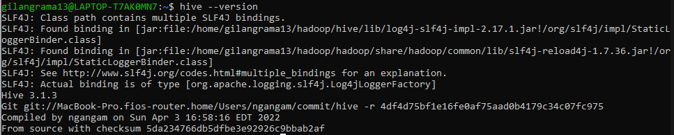
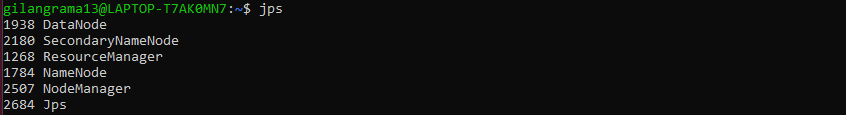
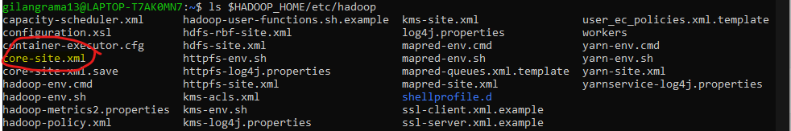
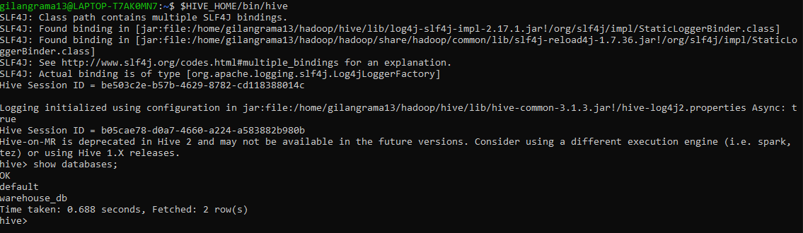

# How To Install Hive on WSL
Apache Hive is an enterprise data warehouse system used to query, manage, and analyze data stored in the Hadoop Distributed File System.

## Prerequisite
- __WSL 2__
- __Java JDK 1.8__
- __Hadoop 3.x__, please refer to this [page](../hadoop-installation-on-wsl/README.md) to install the hadoop.

## Installation
1. Go to [Hive Download Page](). Choose the Hive version then Download the __Binary Download__. In this exploration I use the __Hive 3.1.3__. Or you can direct download the Apache Spark using command below in __WSL__
    ```
    wget https://downloads.apache.org/hive/hive-3.1.3/apache-hive-3.1.3-bin.tar.gz

    ```
2. Once the download process is complete, unpack the downloaded binary file to destination path.
    ```
    # Example destination path ~/hadoop/hive
    mkdir -p ~/hadoop/hive
    # Unpack hadoop file
    tar -xvzf apache-hive-3.1.3-bin.tar.gz -C ~/hadoop/hive --strip 1
    ```
3. Setup __environment variables__ by modify `~/.bashrc`.
    ```
    nano ~/.bashrc
    ```
    and add the hive __environment variables__ as below and save the file.
    ```
    export HIVE_HOME=~/hadoop/hive
    export PATH=PATH=$SPARK_HOME/bin:$PATH:~/.local/bin:$AIRFLOW_HOME:$JAVA_HOME:$JAVA_HOME/bin:$HADOOP_HOME/bin:$HADOOP_HOME/sbin:$HIVE_HOME/bin
    ```
    Then apply the modified `.bashrc` file using command below
    ```
    source ~/.bashrc
    ```
    If the command already executed, make sure the __Hive__ installed properly using command below.
    ```
    hive --version
    ```
    

## Configure Hive
1. Start hadoop using command below.
    ```
    $HADOOP_HOME/sbin/start-all.sh
    ```
    If there is issue regardinng `Connection refused`, please restart the `ssh` using command below.
    ```
    sudo service ssh restart
    ```
    Run the `jps` command to make sure all the services are running successfully.</br>
    </br>
2. Setup the HDFS folders for Hive.
    ```
    hadoop fs -mkdir /tmp 
    hadoop fs -mkdir -p /user/hive/warehouse 
    ```
    Add write and execute permissions to those path using command below
    ```
    hdfs dfs -chmod g+w /tmp
    hdfs dfs -chmod g+w /user/hive/warehouse
    ```
3. Modify `hive-site.xml` file. By default the file is located in `$HIVE_HOME/conf`, we need to modify the file before initiate the database. Use hive-default.xml.template to create the hive-site.xml file:
    ```
    cd $HIVE_HOME/conf
    mv hive-default.xml.template hive-site.xml
    ```
    Add or modify below section to `hive-site.xml`
    ```
    <property>
        <name>hive.metastore.event.db.notification.api.auth</name>
        <value>false</value>
        <description>
        Should metastore do authorization against database notification related APIs such as get_next_notification.
        If set to true, then only the superusers in proxy settings have the permission
        </description>
    </property>
    <property>
        <name>hive.metastore.warehouse.dir</name>
        <value>/user/hive/warehouse</value>
        <description>location of default database for the warehouse</description>
    </property>
    ```
4. Modify `core-site.xml` file. This file available in `$HADOOP_HOME/etc/hadoop`. </br>
</br>
    Please add the following configurations
    ```
    <property>
        <name>hadoop.proxyuser.yourusername.hosts</name>
        <value>*</value>
    </property>
    <property>
        <name>hadoop.proxyuser.yourusername.groups</name>
        <value>*</value>
    </property>
    ```
    modify `yourusername` in the section above to your current username.
5. Initiate database using command below.
    ```
    $HIVE_HOME/bin/schematool -dbType <dbname> -initSchema
    ```
    you can fill the `dbname` arguments using the following values:
    ```
    derby|mysql|postgres|oracle|mssql
    ```
    by default, Apache Derby will be used. So, we will initiate database using command below.
    ```
    $HIVE_HOME/bin/schematool -dbType derby -initSchema
    ```
6. After the installation finished, you can access hive using command below
    ```
    $HIVE_HOME/bin/hive
    ```
    </br>
    There is only `default` database that available on your first launch. The `warehouse_db` is created manually by the author.

## Common Issues
### Illegal character entity
Sometimes we got an error regarding `Illegal character entity` and the error will look like below messages.</br>
<details>
    <summary>show error</summary>

    ```
    Exception in thread "main" java.lang.RuntimeException: com.ctc.wstx.exc.WstxParsingException: Illegal character entity: expansion character (code 0x8
    at [row,col,system-id]: [3215,96,"file:/home/username/hadoop/hive/conf/hive-site.xml"]
            at org.apache.hadoop.conf.Configuration.loadResource(Configuration.java:3092)
            at org.apache.hadoop.conf.Configuration.loadResources(Configuration.java:3041)
            at org.apache.hadoop.conf.Configuration.loadProps(Configuration.java:2914)
            at org.apache.hadoop.conf.Configuration.addResourceObject(Configuration.java:1034)
            at org.apache.hadoop.conf.Configuration.addResource(Configuration.java:939)
            at org.apache.hadoop.hive.conf.HiveConf.initialize(HiveConf.java:5154)
            at org.apache.hadoop.hive.conf.HiveConf.<init>(HiveConf.java:5107)
            at org.apache.hive.beeline.HiveSchemaTool.<init>(HiveSchemaTool.java:96)
            at org.apache.hive.beeline.HiveSchemaTool.main(HiveSchemaTool.java:1473)
            at java.base/jdk.internal.reflect.NativeMethodAccessorImpl.invoke0(Native Method)
            at java.base/jdk.internal.reflect.NativeMethodAccessorImpl.invoke(NativeMethodAccessorImpl.java:62)
            at java.base/jdk.internal.reflect.DelegatingMethodAccessorImpl.invoke(DelegatingMethodAccessorImpl.java:43)
            at java.base/java.lang.reflect.Method.invoke(Method.java:566)
            at org.apache.hadoop.util.RunJar.run(RunJar.java:323)
            at org.apache.hadoop.util.RunJar.main(RunJar.java:236)
    Caused by: com.ctc.wstx.exc.WstxParsingException: Illegal character entity: expansion character (code 0x8
    at [row,col,system-id]: [3215,96,"file:/home/username/hadoop/hive/conf/hive-site.xml"]
            at com.ctc.wstx.sr.StreamScanner.constructWfcException(StreamScanner.java:634)
            at com.ctc.wstx.sr.StreamScanner.throwParseError(StreamScanner.java:504)
            at com.ctc.wstx.sr.StreamScanner.reportIllegalChar(StreamScanner.java:2469)
            at com.ctc.wstx.sr.StreamScanner.validateChar(StreamScanner.java:2416)
            at com.ctc.wstx.sr.StreamScanner.resolveCharEnt(StreamScanner.java:2382)
            at com.ctc.wstx.sr.StreamScanner.fullyResolveEntity(StreamScanner.java:1528)
            at com.ctc.wstx.sr.BasicStreamReader.nextFromTree(BasicStreamReader.java:2818)
            at com.ctc.wstx.sr.BasicStreamReader.next(BasicStreamReader.java:1121)
            at org.apache.hadoop.conf.Configuration$Parser.parseNext(Configuration.java:3396)
            at org.apache.hadoop.conf.Configuration$Parser.parse(Configuration.java:3182)
            at org.apache.hadoop.conf.Configuration.loadResource(Configuration.java:3075)
            ... 14 more
    ```
</details>

If the error occur, modify the `hive-site.xml` then search for the `illegal character`, this error might occur in section below
```
<description>
     Ensures commands with OVERWRITE (such as INSERT OVERWRITE) acquire Exclusive locks for&#8;transactional tables. This ensures that inserts (w/o overwrite) running concurrently
     are not hidden by the INSERT OVERWRITE.
</description>
```
you need to delete the character between __for__ and __transactional__.
### Guava Incompatibility Error in Hive
If the Derby database does not successfully initiate,  you might receive below error.</br>
<details>
    <summary>show error</summary>

    ```
    Exception in thread "main" java.lang.NoSuchMethodError: com.google.common.base.Preconditions.checkArgument(ZLjava/lang/String;Ljava/lang/Object;)V
            at org.apache.hadoop.conf.Configuration.set(Configuration.java:1357)
            at org.apache.hadoop.conf.Configuration.set(Configuration.java:1338)
            at org.apache.hadoop.mapred.JobConf.setJar(JobConf.java:536)
            at org.apache.hadoop.mapred.JobConf.setJarByClass(JobConf.java:554)
            at org.apache.hadoop.mapred.JobConf.<init>(JobConf.java:448)
            at org.apache.hadoop.hive.conf.HiveConf.initialize(HiveConf.java:4045)
            at org.apache.hadoop.hive.conf.HiveConf.<init>(HiveConf.java:4003)
            at org.apache.hadoop.hive.common.LogUtils.initHiveLog4jCommon(LogUtils.java:81)
            at org.apache.hadoop.hive.common.LogUtils.initHiveLog4j(LogUtils.java:65)
            at org.apache.hadoop.hive.cli.CliDriver.run(CliDriver.java:702)
            at org.apache.hadoop.hive.cli.CliDriver.main(CliDriver.java:686)
            at sun.reflect.NativeMethodAccessorImpl.invoke0(Native Method)
            at sun.reflect.NativeMethodAccessorImpl.invoke(NativeMethodAccessorImpl.java:62)
            at sun.reflect.DelegatingMethodAccessorImpl.invoke(DelegatingMethodAccessorImpl.java:43)
            at java.lang.reflect.Method.invoke(Method.java:498)
            at org.apache.hadoop.util.RunJar.run(RunJar.java:323)
            at org.apache.hadoop.util.RunJar.main(RunJar.java:236)
    ```
</details>

If you got the above error message, you need to delete guava jar in __Hive__ and replace with the guava jar in __Hadoop__.
```
rm $HIVE_HOME/lib/guava-19.0.jar
cp $HADOOP_HOME/share/hadoop/hdfs/lib/guava-27.0-jre.jar $HIVE_HOME/lib/
```
You need to rerun the initate derby database using command below
```
$HIVE_HOME/bin/schematool -dbType derby -initSchema
```

