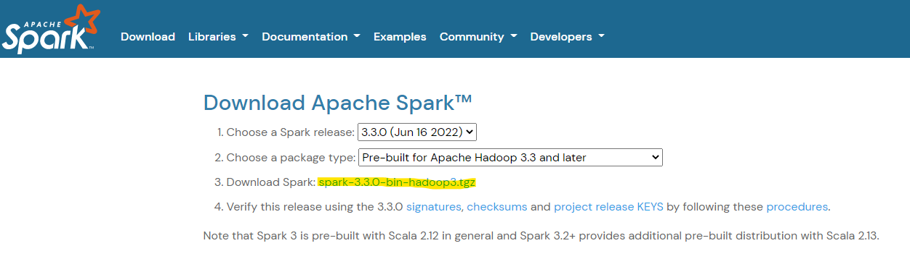
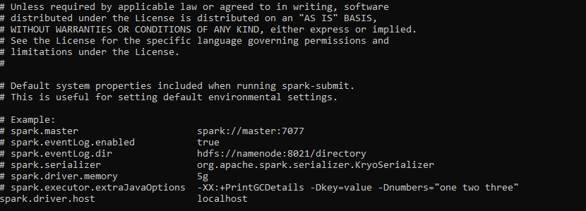
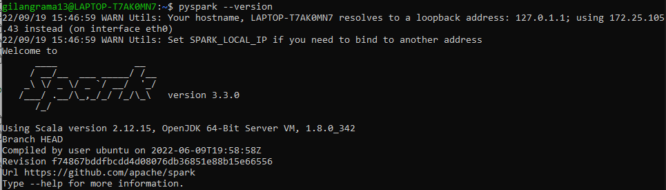

# How To Install PySpark on WSL

## Prerequisite
- Python >= 3.7. Check your python version using command below
    ```
    python3 --version
    ```
- Java JDK 1.8. Installing PySpark also install the spark-shell which running on scala, so we need java to install the spark. Check your python version using command below
    ```
    java -version
    ```

## Installation

### Using PyPI
1. Install PySpark using PyPI using command below
    ```
    pip install pyspark==3.3.0
    ```
2. Install extra dependencies using command below
    ```
    # Spark SQL
    pip install pyspark[sql]
    # pandas API on Spark
    pip install pyspark[pandas_on_spark] plotly  # to plot your data, you can install plotly together.
    ```
3. Create __PYSPARK_HADOOP_VERSION__ environment variables using command below
    ```
    export PYSPARK_HADOOP_VERSION=2 pip install pyspark
    ```

### Manually Downloading
1. Go to [Apahe Spark Download Page](https://spark.apache.org/downloads.html). Choose the Spark version then Download the Apache Spark File. Or you can direct download the Apache Spark using command below in WSL
    ```
    wget https://www.apache.org/dyn/closer.lua/spark/spark-3.3.0/spark-3.3.0-bin-hadoop3.tgz
    ```
    
2. Unpack the downloaded file to destination path
    ```
    # Example destination path ~/hadoop/spark
    mkdir -p ~/hadoop/spark
    # Unpack spark file
    tar -xvzf spark-3.3.0-bin-hadoop3.tgz -C ~/hadoop/spark --strip 1
    ```
3. Setup environment variables. Add __SPARK_HOME__ environment varibales and update the __SPARK_HOME/bin__ to __PATH__ environment variables.
    ```
    # Edit .bashrc file
    nano ~/.bashrc

    # Add below environment variables and save the .bashrc file
    export SPARK_HOME=~/hadoop/spark   
    export PATH=$SPARK_HOME/bin:$PATH
    ```
4. Setup Spark default configurations. Run following command to create spark default config:
    ```
    cp $SPARK_HOME/conf/spark-defaults.conf.template $SPARK_HOME/conf/spark-defaults.conf
    ```
    Edit the spark config file
    ```
    nano $SPARK_HOME/conf/spark-defaults.conf
    ```
    Add following line 
    ```
    spark.driver.host	localhost
    ``` 
    then save. </br>
    
5. Restart your WSL and start using pySpark.</br>
    
    